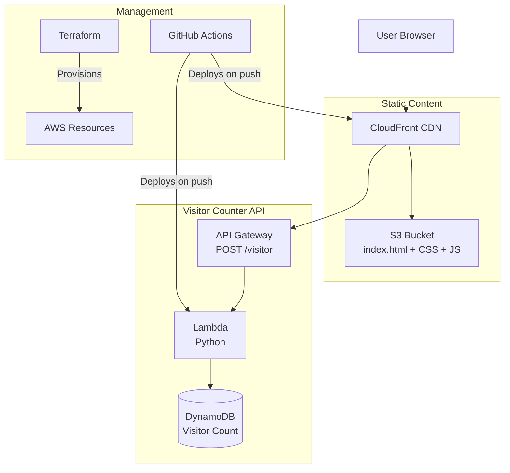

# hasansyed.dev

Live Deployment: [https://hasansyed.dev](https://hasansyed.dev)

Serverless personal portfolio deployed with AWS S3 + Cloudfront, with an HTML frontend, and DynamoDB + Lambda backend.

---

## Overview

This is my personal portfolio and cloud resume project. It's a fully serverless static site that:

- Serves my resume and project highlights from an S3 bucket
- Uses CloudFront for global CDN caching and HTTPS
- Implements a **visitor counter** via API Gateway, Lambda (Python), and DynamoDB
- Is managed entirely as **infrastructure as code** with Terraform
- Automatically deploys on every `git push` using GitHub Actions

The site is secure (no public S3 access), fast (sub-100ms latency), and costs less than $0.50/month to operate.

## Architecture

## Features

| Feature | Implementation |
|---------|----------------|
| Static hosting | S3 + CloudFront |
| Visitor counter | API Gateway + Lambda + DynamoDB |
| Infrastructure as Code | Terraform |
| CI/CD | GitHub Actions |
| Security | Origin Access Control (S3 private) |

## Tech Stack

- **Cloud:** AWS (S3, CloudFront, API Gateway, Lambda, DynamoDB, ACM)
- **IaC:** Terraform
- **CI/CD:** GitHub Actions
- **Frontend:** HTML, CSS, JavaScript
- **Backend:** Python

## Performance & Cost

- **Latency:** <100ms global (CloudFront)
- **Counter response:** <200ms
- **Availability:** 99.9%
- **Monthly cost:** ~$0.50 (within Free Tier)

## Connect

- Live: [hasansyed.dev](https://hasansyed.dev)
- GitHub: [hasansyedCS](https://github.com/hasansyedCS)
- LinkedIn: [hasansyedCS](https://linkedin.com/in/hasansyedCS)