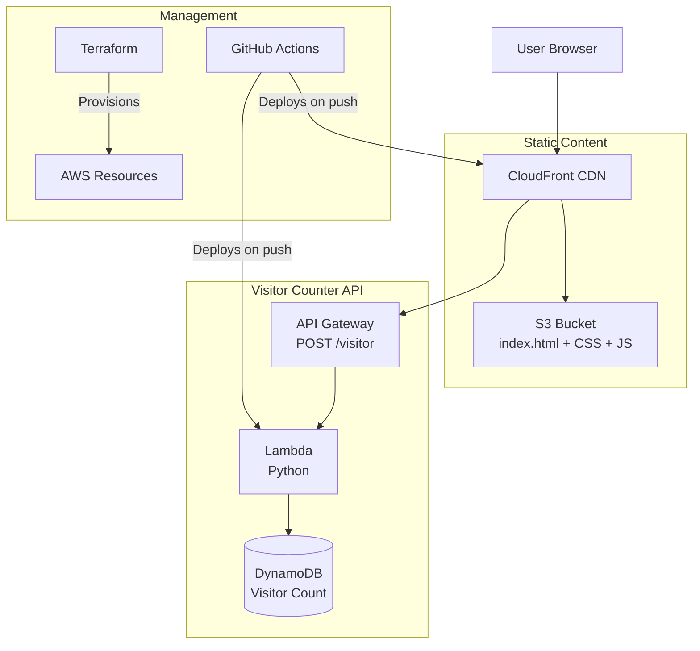

# hasansyed.dev

Live Deployment: [https://hasansyed.dev](https://hasansyed.dev)

Serverless personal portfolio deployed with AWS S3 + Cloudfront, with an HTML frontend, and DynamoDB + Lambda backend.

## Architecture

